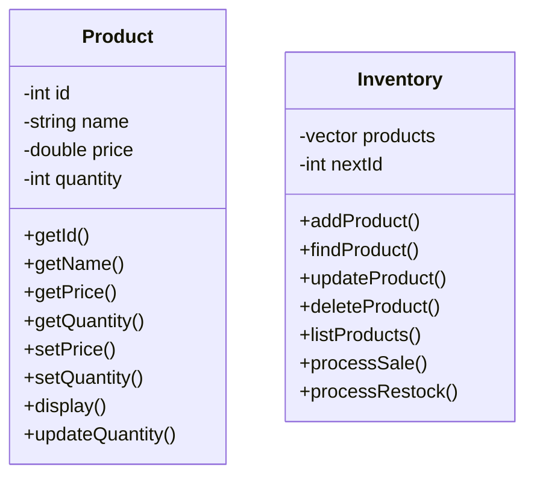

# Inventory Management System in C++

 

A console-based inventory management system built with C++ using Object-Oriented Programming principles, designed for Pakistani currency (PKR).

## Features

- **Product Management**
  - Add new products with ID, name, price (PKR), and quantity
  - Update existing product details
  - Delete products from inventory
  - View all products in formatted list

- **Inventory Operations**
  - Process sales and automatically update stock
  - Process restocks to add inventory
  - Input validation for all operations

- **User-Friendly Interface**
  - Menu-driven console interface
  - Clear error messages
  - Formatted output display

## Getting Started

### Prerequisites

- C++ compiler (g++, clang++, or MSVC)
- Standard C++ library support

### Installation

1. Clone the repository:
   ```bash
   git clone https://github.com/yourusername/inventory-management-system.git
   cd inventory-management-system
   ```

2. Compile the program:
   ```bash
   g++ main.cpp -o inventory
   ```

3. Run the program:
   ```bash
   ./inventory
   ```

## Usage

1. **Main Menu**
   ```
   ===== Inventory Management System =====
   1. Add Product
   2. Update Product
   3. Delete Product
   4. List All Products
   5. Process Sale
   6. Process Restock
   7. Exit
   ```

2. **Adding Products**
   - Enter product details when prompted
   - System automatically assigns unique ID

3. **Viewing Products**
   - Displays all products in formatted output:
   ```
   ID: 1  Name: Sugar      Price: PKR120    Quantity: 50
   ```

4. **Processing Sales/Restock**
   - Enter product ID and quantity
   - System calculates totals in PKR
   - Automatically updates inventory levels

## Code Structure

The system is built using two main classes:

1. **Product Class**
   - Stores product information (ID, name, price, quantity)
   - Provides getters and setters
   - Handles quantity updates

2. **Inventory Class**
   - Manages collection of Product objects
   - Provides all inventory operations
   - Handles product ID generation

## Class Diagram



## Contributing

Contributions are welcome! Please follow these steps:

1. Fork the project
2. Create your feature branch (`git checkout -b feature/AmazingFeature`)
3. Commit your changes (`git commit -m 'Add some amazing feature'`)
4. Push to the branch (`git push origin feature/AmazingFeature`)
5. Open a Pull Request

## Future Enhancements

- Add file persistence to save inventory between runs
- Implement search functionality
- Add categories for products
- Generate sales reports
- Add user authentication


## Contact

Your Name - [Muhammad Taha](https://twitter.com/yourtwitter) - toaha155@gmail.com

Linkedin: [https://www.linkedin.com/in/muhammad-taha101/](https://www.linkedin.com/in/muhammad-taha101/)

